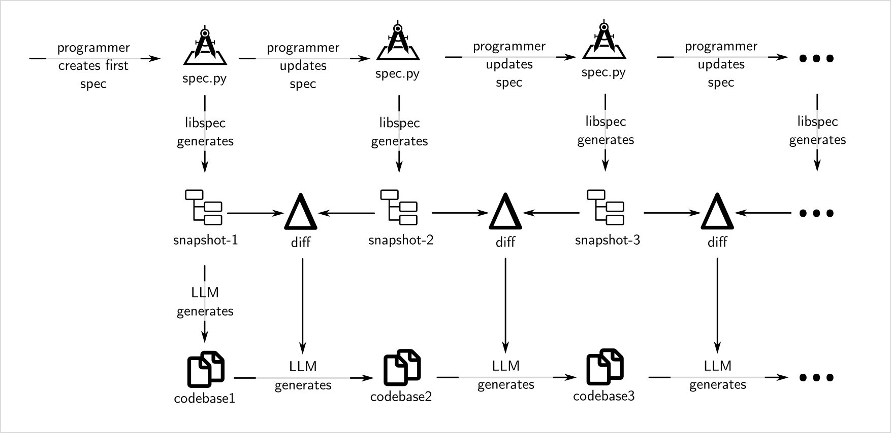

# libspec

[](https://github.com/drhodes/libspec/actions/workflows/ci.yml)
[](https://drhodes.github.io/libspec/)
[](https://pypi.org/project/libspec/)
[](https://pypi.org/project/libspec/)
[](https://github.com/drhodes/libspec/blob/main/LICENSE)

> **an ounce of spec is worth a pound of tokens**


`libspec` is a **Specification Management System** in Python. Similar in spirit 
to object-relation mapping (ORM), libspec uses an Object Specification Mapping 
to compile logical requirements into structured database snapshots. Instead of 
generating SQL, it tracks how requirements evolve over time.

By diff'ing snapshots and using a Model Context Protocol (MCP) server, it 
provides a centralized context layer for local coding agents to trace specs directly 
to generated code. The developer workflow is incremental and exploratory, less like 
gambling and more like delegating.




### Example Spec

Here is the specification `spec/err.py` used to establish fundamental code quality, error handling, and robustness constraints across the entire project via multiple inheritance:

```python
from libspec import Ctx, Feature, Requirement


# The Err docstrings are compiled into specification snapshots and 
# injected as prompt context for LLM code generation.
class Err(Ctx):
    """
    It is important that error handling be done excellently.

    If a function can fail, then it needs to do so in the most elegant way
    possible. Error reporting, handling, exceptions and all aspects of failure
    must be taken to extreme. It should be possible to understand the program
    by reading the error messages.

    When an error occurs there should be a story about the failure at each step
    of the way. What went wrong and why.
    """


class BoilerPlate(Ctx):
    """
    If you can see a way to reduce boiler plate, then do it.
    """


class FunctionLines(Ctx):
    """
    Try to keep functions under 20 lines.
    """


class Indentation(Ctx):
    """
    Try to keep indentation under 4 levels.
    """


class PreCondition(Ctx):
    """
    Functions should validate preconditions at their entry point.

    Instead of using `assert` statements (which can be disabled globally),
    raise explicit, descriptive exceptions (e.g., ValueError, TypeError, or
    custom domain exceptions) to robustly reject malformed input.
    """


class GlobalMutableState(Ctx):
    """
    Broadly you should avoid global mutable state.
    """


class PostCondition(Ctx):
    """
    Before a function returns, it should verify postconditions to ensure
    invariant properties hold true.

    Raise explicit, descriptive exceptions (such as RuntimeError or domain
    exceptions) rather than using `assert` statements to handle post-execution
    verification failures.
    """


# Composite specification aggregating precondition, postcondition, and global state avoidance guidelines.
class DefensiveProgramming(PreCondition, PostCondition, GlobalMutableState):
    pass


class Refactor(BoilerPlate, FunctionLines, Indentation):
    """
    Always keep an eye out for ways to generalize a function if it's utility
    might be helpful to other functions.

    Classes should be implemented in their own files with filename being the
    classname with correct naming convention
    """


class Robustness(DefensiveProgramming):
    """
    Always prioritize library-provided constructors for complex objects. Ensure
    all components are fully initialized before calling any state- mutating
    methods. Assume private internal state is uninitialized until the official
    constructor has returned. When extending library components, prioritize
    composition (pointers) over embedding by value to avoid risky state-copying
    bugs.

    Use dependency injection for system level objects for composability and to
    make testing easier.
    """


# Use multiple inheritance to endow Feature and Requirement specs with
# disciplined error handling guidance from above.
class Feat(Err, Refactor, Robustness, Feature):
    pass


class Req(Err, Refactor, Robustness, Requirement):
    pass
```

# The Object Model 

Each class declares a specification fragment that is optionally a
Jinja2 template string. More about that later...

## Inheritance

Inheritance means "does this and more." The inherited superclass
docstrings are normative, but the compiled XML preserves them as
`<inherits><ref>...</ref></inherits>` references instead of prepending
their prose into the child docstring. Renderers such as `libspec diff`
can expand those refs when a review needs the inherited context.

## Mixins 

Mixins help get around the diamond problem. (TODO: write more about this)

## Versioning

Note that the versioning of `libspec` is still being hammered
out. Currently, the version of `libspec` appears in the generated XML
(`libspec-version` field). But, how diffs will be performed on
different versions is unexplored.
