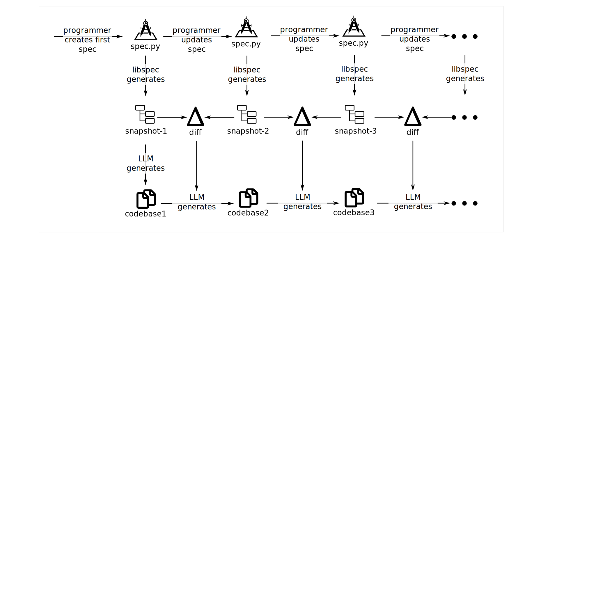

# libspec

`libspec` is a library for **Specification Driven Development** in
Python. Similar in spirit to object relation mapping (ORM), libspec
offers a map to specifications, or object specification
mapping. Instead of generating SQL, we're generating specs geared
towards code generation with LLMs.

The aim is to build out an ecosystem of reusable specs, avoid wasting
tokens vibecoding, and manage context bloat is mitigated diffing specs
and using source maps.




### Example Spec

Here is a piece of a spec used to declare a small web app for managing a locker system

```python

from libspec import Requirement
from libspec import RestMixin, Feature
from .view_types import PublicView, AdminView

class Django(Requirement):
    '''Setup a Django environment using 6.0.2, it should use sqlite3 for                                                                                                         now. Configure REST_FRAMEWORK and djangorestframework.                                                                                                                                                                                                                                                                                                    Create a django app (with $ ... startapp) called `lockers` and                                                                                                               wire it up. It should include an example model, view and urls to                                                                                                             get started.                                                                                                                                                                                                                                                                                                                                              Please ensure that the models are added to admin interface and                                                                                                               REST API is exposed.                                                                                                                                                         '''

class GunicornServer(Requirement):
    '''In the Makefile, create a rule to run the gunicorn server on port 8000'''

class DevelopmentServer(Requirement):
    '''In the Makefile, create a rule to run the development server on port 8000'''

class Model(RestMixin, Requirement):
    '''ensure this django model is added to the admin interface'''

class LockerBank(Model):
    '''Represent a physical bank of lockers. Should include a unique name.'''

class QrCode(Model):
    '''Represent a QR code attached to a locker. Should include a unique value,                                                                                                  matching the format in QrCodeRequirement.'''

class Locker(Model):
    '''Represent an individual locker unit. Should be associated with a LockerBank                                                                                               and two QrCodes (one inside, one outside). Should track occupancy status                                                                                                     and the timestamp of the last inside QR code scan.                                                                                                                                                                                                                                                                                                        A locker will have a small number that uniquely identifies it                                                                                                                within a locker bank.                                                                                                                                                                                                                                                                                                                                     When a locker is created, it should automatically create the qr                                                                                                              codes associated with it.                                                                                                                                                    '''

# More follows, but this is the idea.

```


