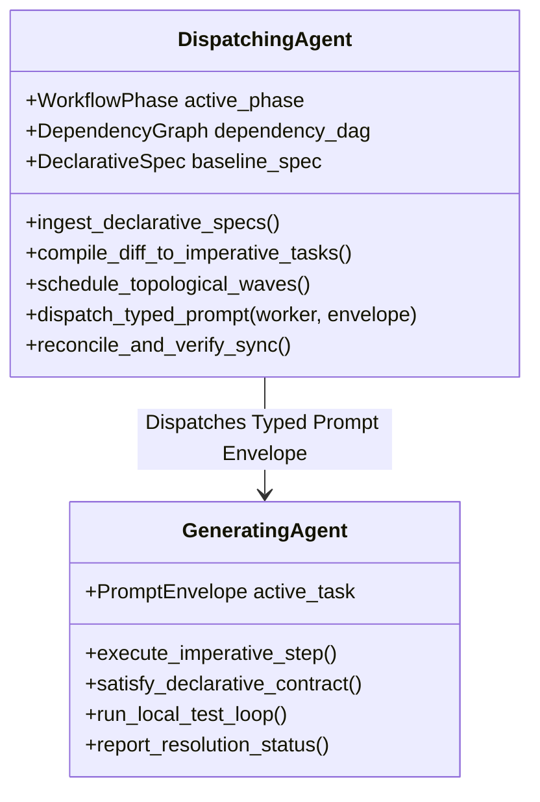
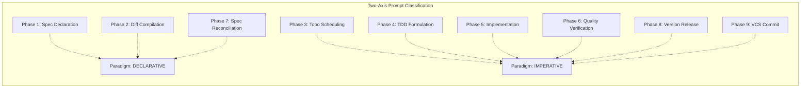

# Design: Phase-Typed Prompts & Declarative vs. Imperative Execution Paradigms

**Version:** 1.0.0  
**Status:** Draft / Proposal  
**Author:** Google DeepMind Advanced Agentic Coding Team & Derek  
**Date:** 2026-08-23  
**Target Subsystems:** `libspec.workflow`, `libspec.spec_diff`, `libspec.agent_config`, `.agents/skills/`, `spec/`

---

## 1. Executive Summary & Core Philosophy

In modern spec-driven development with autonomous AI agents, a critical architectural distinction exists between **what the system is** (its enduring architecture, contracts, and invariants) and **how to transition the codebase to that state** (the tactical, procedural steps executed by a coding worker).

Today, prompts provided to coding agents often mix architectural definitions with one-off operational commands. This leads to architectural drift, polluted specifications, and confusion between the **orchestrating/dispatching agent** and the **generating/worker agent**.

This design formalizes three core architectural tenets for `libspec`:

1. **Declarative Specifications in `./spec` as the Long-Lived Source of Truth**:
   The specifications residing in `./spec/*.py` are strictly **declarative**. They declare system invariants, interface contracts, behavioral requirements, data schemas, and architectural boundaries. They represent the target destination.
2. **Imperative Prompts as Ephemeral, Diff-Generated Transition Directives**:
   **Imperative** prompts represent one-off, procedural, and disposable instructions (e.g. "Add function $F$ to module $M$", "Refactor caller $C$", "Fix regression in test $T$"). **Imperative instructions must never live inside `./spec`**, because `./spec` is an architectural design document, whereas imperative instructions are a transient construction artifact.
3. **`libspec diff` as the Declarative-to-Imperative Compiler**:
   The mathematical bridge connecting declarative specs and imperative code generation is `libspec diff`:
   $$\text{Imperative Instructions} = \text{Declarative Spec} \ominus \text{Current Codebase State}$$
   `libspec diff` computes specification drift and compiles component mutations into structured, phase-typed **Imperative Action Prompts** that guide the generating agent to converge on the declared spec.

```mermaid
flowchart TD
    subgraph Declarative Architecture ["Declarative Architecture (./spec/*.py)"]
        SpecA["Requirement: ScannerPersistenceReq"]
        SpecB["Feature: AuditCliFeat"]
        SpecA -->|depends_on| SpecB
    end

    subgraph Diff Compiler ["libspec diff & Topo Engine"]
        DiffEngine["libspec diff / dependencies --topo"]
        Delta["Component Action Diffs (Delta Tasks)"]
    end

    subgraph Dispatcher ["Dispatching / Orchestrating Agent"]
        Orchestrator["Workflow Phase Awareness<br/>Topological Wave Scheduler<br/>Context & Boundary Manager"]
    end

    subgraph Worker Pool ["Generating / Worker Agents"]
        AgentTDD["Worker: TDD Phase (Imperative)"]
        AgentCode["Worker: Code Gen Phase (Imperative)"]
        AgentQA["Worker: QA & Verification (Imperative)"]
    end

    subgraph Codebase ["Production Codebase"]
        Source["src/libspec/..."]
        Tests["tests/test_...py"]
    end

    Declarative Architecture -->|Live Spec Snapshot| DiffEngine
    Codebase -->|Current State / VCS HEAD| DiffEngine
    DiffEngine --> Delta
    Delta --> Orchestrator
    Orchestrator -->|Phase 4: TDD Typed Prompt| AgentTDD
    Orchestrator -->|Phase 5: Implementation Typed Prompt| AgentCode
    Orchestrator -->|Phase 6: QA Typed Prompt| AgentQA
    AgentTDD -->|Write Tests| Tests
    AgentCode -->|Write Code| Source
    AgentQA -->|Verify & Lint| Codebase
    Codebase -->|Re-sync Audit (Phase 7)| Orchestrator
```

---

## 2. Declarative vs. Imperative Paradigms

To establish clear conceptual and operational boundaries, we define the two paradigms across their lifecycle, representation, and target consumers:

| Attribute | Declarative Specification (`./spec`) | Imperative Instruction / Prompt |
|---|---|---|
| **Semantic Nature** | **What the system IS** (invariants, contracts, interfaces, types, constraints, user journeys). | **What actions to DO now** (procedural steps, edits, patches, refactors, bug fixes). |
| **Storage & Location** | Versioned Python classes in `./spec/*.py` committed to Git. | Ephemeral prompts dispatched over MCP / Agent queues; never stored in `./spec`. |
| **Temporal Scope** | **Enduring & Evolutionary**: Persists throughout the project's lifetime across major/minor versions. | **Disposable & Transient**: Retired immediately once the codebase satisfies the contract. |
| **Granularity** | Coarse-to-fine architectural components (`Req`, `Feat`, `API`, `DataSchema`, `Constraint`). | Discrete operational steps (file paths, line ranges, specific AST edits, test assertions). |
| **Derivation** | Authored by architects, humans, or high-level spec-authoring agents. | Compiled automatically by `libspec diff` and the topological scheduler from spec deltas. |
| **Cognitive Target** | The Dispatching Agent (for macro-planning) and Human Reviewers. | The Generating Agent (for immediate, focused execution). |

### 2.1 The Non-Colocation Tenet

> [!IMPORTANT]
> **Imperative instructions must NOT live inside `./spec`.**
> If task checklists, temporary migration scripts, or procedural step-by-step instructions are authored directly into `./spec`, the specification loses its authority as a clean architectural blueprint. `./spec` becomes cluttered with historical construction residue. 
> 
> Instead, `./spec` remains purely declarative. When changes occur, `libspec diff` derives the necessary imperative instructions on the fly.

---

## 3. Cognitive Roles: Dispatcher vs. Generator

A key insight in multi-agent and pair-programming systems is the separation of responsibilities between **the agent dispatching the work** and **the agent generating the code**:



### 3.1 The Dispatching Agent (Macro-Orchestrator)
The Dispatching Agent is responsible for whole-system cohesion:
- **Phase Awareness**: Knows precisely which phase of the development lifecycle the project is in (e.g. Spec Authoring vs. TDD vs. Reconciliation).
- **Macro-Context Understanding**: Understands the entire declarative architecture (`./spec`), including topological dependencies (`depends_on`), MRO quality constraints (`inherits`), and inter-module contracts.
- **Decomposition & Scheduling**: Ingests component diffs from `libspec diff`, computes topological wave batches via `libspec dependencies --topo`, and packages them into discrete, self-contained **Typed Prompt Envelopes**.
- **State Reconciliation**: Collects worker outputs, handles merge/retry logic, and runs verification audits to guarantee zero specification drift.

### 3.2 The Generating Agent (Micro-Worker)
The Generating Agent executes within a focused sandbox:
- **Execution Focus**: Receives a single **Typed Prompt Envelope** containing exact operational objectives, target file paths, prerequisite contracts, and verification criteria.
- **Cognitive Isolation**: Does not need to maintain the global state of the entire project or workflow graph; its only responsibility is satisfying the local declarative contract and passing the required tests.
- **Tight Verification Loop**: Iterates rapidly through code editing, test execution, and lint verification until the local task criteria are fulfilled.

---

## 4. The Prompt Typing Taxonomy

Every prompt in the `libspec` ecosystem is classified along two orthogonal axes:
1. **`ParadigmType`**: Declarative vs. Imperative.
2. **`WorkflowPhase`**: The active phase in the 9-step development lifecycle.



### 4.1 Phase-by-Phase Prompt Taxonomy

| Phase # | Phase Identifier | Primary Paradigm | Purpose & Prompt Payload | Verification Gate |
|---|---|---|---|---|
| **1** | `SPEC_DECLARATION` | `DECLARATIVE` | Prompts guiding the decomposition of broad capabilities into granular `Req`/`Feat` classes in `spec/*.py`. Focuses on interface contracts, schemas, and `depends_on` relationships. | `libspec compile` / Syntax AST check |
| **2** | `DIFF_COMPILATION` | `DECLARATIVE` $\to$ `IMPERATIVE` | Prompts triggering `libspec diff` to analyze drift against Git `HEAD` or prior snapshots, compiling mutations into structured component action diffs. | Non-empty diff detected & parsed |
| **3** | `TOPOLOGICAL_SCHEDULING` | `IMPERATIVE` | Prompts organizing component action diffs into dependency waves using topological sorting over `depends_on` edges. | Valid DAG (no cyclic dependencies) |
| **4** | `TDD_FORMULATION` | `IMPERATIVE` *(Contract-Driven)* | Prompts directing the worker to write comprehensive unit and integration tests formalizing the declarative acceptance criteria of the component. | Tests fail with expected contract assertions |
| **5** | `CODE_GENERATION` | `IMPERATIVE` *(Goal-Directed)* | Prompts directing the worker to implement production code in target modules until all TDD tests pass. | Test suite passes 100% |
| **6** | `QUALITY_VERIFICATION` | `IMPERATIVE` | Prompts running static analysis (`mypy`), linting (`ruff check`), formatting (`ruff format`), and dead-code detection (`vulture`). | Zero lint/type errors |
| **7** | `SPEC_RECONCILIATION` | `DECLARATIVE` | Prompts re-running `libspec diff` to ensure live specs match implementation claims and no undocumented code was introduced. | `libspec diff` returns "No changes detected" |
| **8** | `VERSION_RELEASE` | `IMPERATIVE` | Prompts determining SemVer impact (major/minor/patch) and bumping version in `pyproject.toml`. | Version string synchronized |
| **9** | `VCS_COMMIT` | `IMPERATIVE` | Prompts synthesizing conventional git commit messages linking spec references and diff footprints. | Clean Git status |

---

## 5. Formal Data Models & Schemas

To ensure interoperability between the CLI, MCP server, and dispatching agents, we formalize the prompt data structures in Python:

```python
from enum import Enum
from dataclasses import dataclass, field
from typing import Any, Optional, Union

class PromptParadigm(str, Enum):
    DECLARATIVE = "declarative"
    IMPERATIVE = "imperative"

class WorkflowPhase(str, Enum):
    SPEC_DECLARATION = "spec_declaration"
    DIFF_COMPILATION = "diff_compilation"
    TOPOLOGICAL_SCHEDULING = "topological_scheduling"
    TDD_FORMULATION = "tdd_formulation"
    CODE_GENERATION = "code_generation"
    QUALITY_VERIFICATION = "quality_verification"
    SPEC_RECONCILIATION = "spec_reconciliation"
    VERSION_RELEASE = "version_release"
    VCS_COMMIT = "vcs_commit"

@dataclass(frozen=True)
class DeclarativeContractPayload:
    """Carries declarative specification details from ./spec."""
    component_ref: str
    component_type: str  # Req, Feat, API, DataSchema
    docstring: str
    inherits: list[str]
    depends_on: list[str]
    fields: dict[str, str] = field(default_factory=dict)
    source_target: Optional[str] = None
    source_file: Optional[str] = None

@dataclass(frozen=True)
class ImperativeActionPayload:
    """Carries actionable, procedural steps derived from diffs or operational gates."""
    action_id: str
    action_type: str  # CREATE_MODULE, ADD_METHOD, MODIFY_SCHEMA, WRITE_TEST, FIX_LINT
    target_files: list[str]
    step_sequence: list[str]
    prerequisite_contracts: list[str]
    verification_command: str
    context_hints: dict[str, Any] = field(default_factory=dict)

@dataclass(frozen=True)
class PromptEnvelope:
    """Standardized envelope wrapping typed prompts for agent dispatch."""
    envelope_id: str
    phase: WorkflowPhase
    paradigm: PromptParadigm
    target_ref: Optional[str]
    payload: Union[DeclarativeContractPayload, ImperativeActionPayload]
    dispatch_timestamp: str
    timeout_seconds: int = 300
```

---

## 6. The `libspec diff` Imperative Delta Compiler

`libspec diff` acts as the transformation engine that reads declarative spec changes and generates imperative instructions.

### 6.1 Transformation Mechanics

When `generate_native_patch()` runs:
1. Compiles the declarative target from `./spec` (e.g. `ScannerPersistenceReq`).
2. Identifies new/changed components and compares them against Git baseline.
3. Formulates structured **Component Action Diffs**:

```
============================================================
Diffing State: Git Ref: HEAD -> PENDING (Live Spec: spec/persistence.py)
============================================================

[NEW] ScannerPersistenceReq
  • Phase: CODE_GENERATION | Paradigm: IMPERATIVE
  • Topological Wave: Wave 3 (Prerequisites: [spec.schema.OutputSchemaReq])
  • Target Implementation: libspec/persistence.py
  • Docstring:
      State persistence and scan resumption engine using SQLite3.
  • Imperative Action Steps:
      1. [TDD] Create `tests/test_persistence.py` with test cases verifying
         transaction rollback on corrupted journal files.
      2. [IMPLEMENT] Create `libspec/persistence.py` implementing `StateStore`.
      3. [IMPLEMENT] Add `resume_scan(session_id: str)` meeting the OutputSchema contract.
  • Verification Gate:
      `uv run pytest tests/test_persistence.py && uv run ruff check libspec/persistence.py`
```

---

## 7. Updated Workflow Integration (`.agents` & Libspec Core)

The 9-step agent workflow is updated across `.agents/skills/libspec-agent-workflow/SKILL.md`, `libspec/workflow.py`, and agent configuration templates:

```markdown
## Dev Workflow (Phase-Typed & Paradigm-Aware)

1. **Phase 1: Edit Spec [DECLARATIVE]**:
   Edit/define requirements and features in `spec/*.py`. Decompose broad requirements into granular, single-responsibility classes (e.g., `HelpCommandReq`, `SnapshotsCommandReq`). Specs DECLARE the system architecture; do NOT put imperative task steps here.
2. **Phase 2: Diff Spec (MANDATORY BEFORE CODING) [DECLARATIVE -> IMPERATIVE]**:
   Run `uv run libspec diff` (or `mcp_libspec_diff`) to compile specification drift into structured imperative component action diffs.
3. **Phase 3: Sort Implementation Ordering [IMPERATIVE]**:
   Run `uv run libspec dependencies` (with `--topo`) to organize components into topological waves based on `depends_on` contracts.
4. **Phase 4: Test Driven Development [IMPERATIVE - Contract Driven]**:
   Write unit and integration tests for components in topological wave order, formalizing the declarative acceptance criteria before writing production code.
5. **Phase 5: Implement [IMPERATIVE - Goal Directed]**:
   Implement production code to satisfy the tests and meet the declarative specification contracts.
6. **Phase 6: Code Quality & Verification [IMPERATIVE]**:
   Run static analysis (`mypy`), linting and formatting (`ruff`), and dead code detection (`vulture`).
7. **Phase 7: Verify Specification Sync [DECLARATIVE]**:
   Run `uv run libspec diff` to ensure live specs match implementation claims and zero drift remains.
8. **Phase 8: Version Bump [IMPERATIVE]**:
   Bump project version in `pyproject.toml` according to Semantic Versioning (`MAJOR.MINOR.PATCH`).
9. **Phase 9: Commit & Present [IMPERATIVE]**:
   Author a clean Git commit message linking spec references and diff footprints, then present to the user.
```

---

## 8. Verification & Rollout Plan

1. **Spec Updates (`spec/agents.py`)**:
   Add formal specification classes declaring:
   - `DeclarativeSpecBoundaryReq`: Strict declarative boundary for `./spec`.
   - `ImperativePromptModelReq`: Model for diff-derived imperative action prompts.
   - `WorkflowPhasePromptTypingReq`: Formalizing the two-axis typing system.
   - `DispatcherGeneratorRoleReq`: Explicit separation of orchestrator vs worker roles.
2. **Core Workflow Update (`libspec/workflow.py` & `.agents`)**:
   Update `get_agent_workflow()` and `.agents/skills/libspec-agent-workflow/SKILL.md` to reflect phase typing and declarative/imperative markers.
3. **Automated Test Coverage (`tests/test_agent_workflow.py`)**:
   Add unit tests verifying that rendered workflows contain explicit phase tags, declarative/imperative paradigm markers, and prompt typing semantics.
4. **Documentation Alignment (`docs/how-to/agent-workflow.md`)**:
   Update user-facing docs explaining how dispatching agents utilize typed prompts to orchestrate subagent workers.
