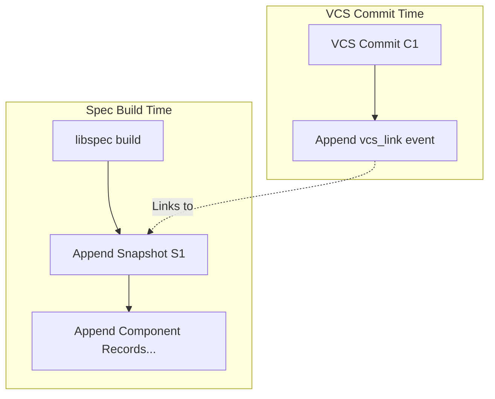
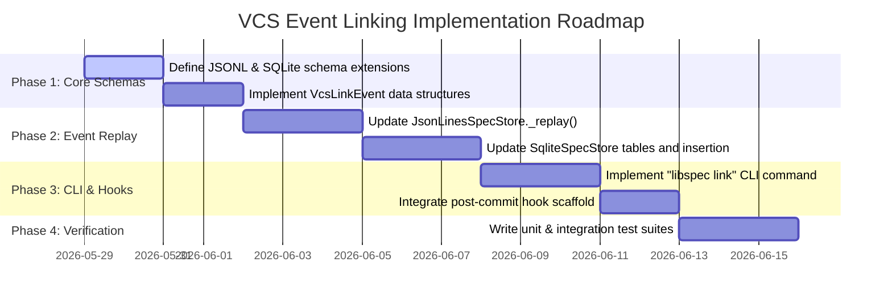

# Design Document: VCS-Agnostic Append-Only Event Linking in Libspec
**Version:** 1.0.0  
**Status:** Draft / Proposal  
**Author:** Antigravity & Derek  

---

## Page 1: Architectural Foundations & Schema Specification

### 1.1 Core Design Philosophy
Libspec operates on a **content-addressed, append-only metadata store**. The current implementation of `JsonLinesSpecStore` appends snapshots and component records sequentially. 

However, during a local development cycle (`libspec build`), the newly created spec snapshot is generated *before* a Git commit is created. This creates a temporal mismatch where the build engine can only record the *parent* Git commit at build time. 

To resolve this mismatch without violating the immutability of the spec store, we introduce an **Event-Sourced Event Linker**. Instead of modifying the historical snapshot record, we treat the association between a spec snapshot and a VCS revision as a **first-class appendable event**.



---

### 1.2 JSON Lines Schema Specification (`.libspec/libspec.jsonl`)
We define a new JSON record schema where `type` is `"vcs_link"`. This record represents an assertion that a given snapshot is introduced or associated with a specific VCS revision.

```json
{
  "type": "vcs_link",
  "snapshot_id": "4fe394b4a89ddbc8",
  "vcs": "git",
  "revision": "42cd02568bf49a04a601abdfae23ad95c10ab8fe",
  "created_at": "2026-05-28T22:05:00.123456Z",
  "metadata": {
    "branch": "main",
    "author": "derek@libspec.org",
    "message": "spec: add file change corruption spec"
  }
}
```

#### Field Specifications:
* **`type` (string, required):** Must be exactly `"vcs_link"`.
* **`snapshot_id` (string, required):** The 16-character hexadecimal identifier of the target snapshot.
* **`vcs` (string, required):** The VCS system type. Standard values include `"git"`, `"hg"`, `"svn"`, `"perforce"`, or `"manual"`.
* **`revision` (string, required):** The revision identifier (commit hash, revision number, etc.).
* **`created_at` (string, required):** ISO-8601 UTC timestamp when the link event was appended.
* **`metadata` (object, optional):** Extensible dictionary carrying contextual VCS metadata.

---

### 1.3 SQLite Schema Migration Path
For projects utilizing the SQLite-backed spec store, we define a corresponding table representation to preserve relational integrity.

```sql
CREATE TABLE IF NOT EXISTS vcs_link (
    id INTEGER PRIMARY KEY AUTOINCREMENT,
    snapshot_id VARCHAR(16) NOT NULL,
    vcs VARCHAR(32) NOT NULL,
    revision VARCHAR(128) NOT NULL,
    created_at TIMESTAMP NOT NULL,
    metadata_json TEXT,
    FOREIGN KEY (snapshot_id) REFERENCES snapshot (id) ON DELETE CASCADE
);

CREATE INDEX IF NOT EXISTS idx_vcs_link_snapshot ON vcs_link (snapshot_id);
```

---

## Page 2: Event Replay State Machine & Store Integrations

### 2.1 The Event Replay State Machine
When loading components from the `JsonLinesSpecStore`, the store replays all historical lines in sequence to reconstruct the in-memory state. We will update the store parser to process `"vcs_link"` records as follows:

```python
# Conceptual Event Replay Logic in JsonLinesSpecStore
def _replay(self):
    self._snapshots = {}
    self._components = {}
    self._vcs_links = []

    with open(self.filepath, "r", encoding="utf-8") as f:
        for line in f:
            data = json.loads(line)
            record_type = data.get("type")

            if record_type == "snapshot":
                snap = Snapshot(
                    id=data["id"],
                    created_at=parse_datetime(data["created_at"]),
                    master_hash=data["master_hash"],
                    git_commit=data.get("git_commit") # Backwards compatibility
                )
                self._snapshots[snap.id] = snap

            elif record_type == "component":
                comp = Component(**data)
                self._components[comp.hash] = comp

            elif record_type == "vcs_link":
                link = VcsLinkEvent(
                    snapshot_id=data["snapshot_id"],
                    vcs=data["vcs"],
                    revision=data["revision"],
                    created_at=parse_datetime(data["created_at"]),
                    metadata=data.get("metadata", {})
                )
                self._vcs_links.append(link)
                
                # Apply the link mutation to the active in-memory snapshot
                if link.snapshot_id in self._snapshots:
                    # Update git_commit property for backwards-compatibility with tests & CLI
                    if link.vcs == "git":
                        self._snapshots[link.snapshot_id].git_commit = link.revision
```

---

### 2.2 Backwards Compatibility & Graceful Upgrades
1. **Fallback git_commit:** Existing legacy snapshots in the JSONL database that already possess a non-null `"git_commit"` in their initial snapshot event are preserved exactly as-is.
2. **Replay Overrides:** If a `vcs_link` event is processed later for an older snapshot, the `vcs_link` revision overrides the initial `git_commit` attribute.
3. **Graceful DB Upgrades:** SQLite stores will automatically detect the absence of the `vcs_link` table at startup and construct it dynamically.

---

## Page 3: VCS-Agnostic Hooking Interface & CLI Extensions

### 3.1 The VCS Linker Command-Line Interface (CLI)
We introduce a standard, decoupled CLI interface to assert link events. This command is executed automatically by VCS hooks or manually by developers:

```bash
libspec link --snapshot <id> --vcs <type> --revision <hash> [--metadata <key=val>]
```

#### Under the Hood:
1. Validates that the `<id>` matches a recorded snapshot in the active spec store.
2. Appends the `{"type": "vcs_link", ...}` record to `.libspec/libspec.jsonl` (or registers a row in SQLite).
3. Prints a success confirmation to stdout:
   `[libspec] Linked snapshot 4fe394b4 to Git commit 42cd025.`

---

### 3.2 Git Post-Commit Automation Hook
To automate this in Git repositories, `libspec init` will write a standard shell script to `.git/hooks/post-commit`:

```bash
#!/bin/sh
# .git/hooks/post-commit - Automated Libspec Linker

# 1. Retrieve the newly generated commit hash
COMMIT_HASH=$(git rev-parse HEAD)

# 2. Find the most recent snapshot that has no linked Git commit
LATEST_SNAPSHOT_ID=$(libspec-repl --latest-unlinked-snapshot)

if [ -n "$LATEST_SNAPSHOT_ID" ]; then
    # 3. Assert the link event in the spec store
    libspec link --snapshot "$LATEST_SNAPSHOT_ID" --vcs git --revision "$COMMIT_HASH" \
                 --metadata branch="$(git branch --show-current)" \
                 --metadata author="$(git log -1 --format='%ae')"
fi
```

---

### 3.3 Extending to Other Version Control Systems

Because the link record design is modular, supporting other version control systems is a matter of minimal configuration:

| VCS | Hook Script Implementation | Triggers / Configuration |
|---|---|---|
| **Mercurial (Hg)** | Execute `libspec link --snapshot "$HG_SNAP" --vcs hg --revision "$HG_NODE"` | Placed in `.hg/hgrc` `[hooks]` section |
| **Subversion (SVN)** | Client-side wrapper/trigger invoking `libspec link` with client revision | Client hook script launcher |
| **Perforce (P4)** | Post-submit trigger script mapping local P4 changelist to the active snapshot | `p4 triggers` table entry |

---

## Page 4: Implementation Roadmap & Milestones



---

## Page 5: The Quadrant Rule for Conditional Linking

### 5.1 Rationale & Problem Statement
In typical specification-driven development, developers check in code in atomic increments. This results in three types of commits:
1. **Spec-only commits:** Writing/editing design requirements in `spec/` before implementing them.
2. **Code-only commits:** Refactoring existing code, fixing implementation bugs, or optimizing performance without changing the underlying specification.
3. **Mixed (Spec + Code) commits:** Implementing a feature that updates the specification and its corresponding source implementation.

If the Git `post-commit` hook compiles and links snapshots blindly on every single commit, the `SpecStore` transaction ledger becomes bloated with redundant or meaningless snapshots, reducing the signal-to-noise ratio of the history. To ensure that snapshots are only compiled and linked at design/implementation checkpoints, we enforce the **Quadrant Rule**.

### 5.2 The Quadrant Truth Table
The decision matrix for automatic snapshot compilation and linking is defined as follows:

| Spec Changes (`spec/`)* | Code Changes (others)** | Action / Linking Behavior |
| :---: | :---: | :--- |
| **No** | **No** | **Ignored** (Empty commit, no action) |
| **Yes** | **No** | **Ignored / Pending** (Specification changes only; remains pending in ledger) |
| **No** | **Yes** | **Ignored** (Implementation changes only; no specification changes) |
| **Yes** | **Yes** | **Compile & Link** (Both spec and code changed; checkpoint reached!) |

* \* **Spec Changes:** Defined as modifications to any tracked files starting with the path prefix `spec/`.
* \*\* **Code Changes:** Defined as modifications to any tracked files *outside* of `spec/`, `.libspec/`, and `.git/`.

### 5.3 CLI Implementation: `--only-on-changes`
To support this logic in a VCS-agnostic, portable, and testable manner, the intelligence is built into the `libspec link` command via the `--only-on-changes` flag:

```bash
libspec link --vcs git --revision <hash> --only-on-changes
```

When this flag is active:
1. The command executes `git diff-tree --no-commit-id --name-only -r --root <revision>` to identify all changed files in the target revision.
2. It parses the file paths and evaluates the Quadrant Truth Table.
3. If the criteria for **Compile & Link** are not met, the command terminates immediately and exits successfully with status code `0` without making any database mutations.

