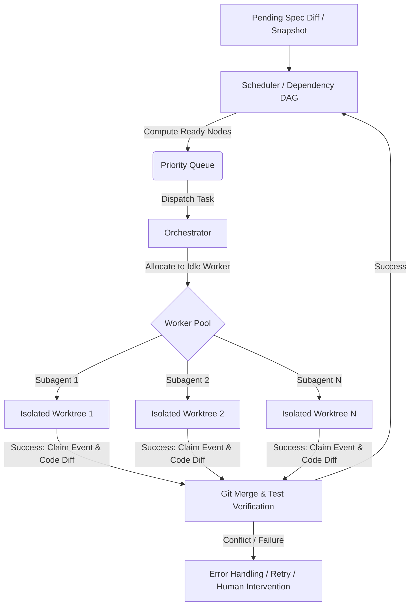

# Brainstorming Design: Parallel Component Implementation via Priority Queue & Subagents

This document outlines the architectural brainstorming for a priority-based scheduler and parallel subagent distribution engine in `libspec`. The goal is to ingest a set of specification components, sort them by dependencies, prioritize them dynamically, and distribute them to multiple parallel coding subagents for implementation and verification.

---

## 1. System Architecture Overview

The system consists of three core logical units:

1. **Dependency Graph & Scheduler (Priority Queue)**: Analyzes dependencies between pending spec components, constructs a Directed Acyclic Graph (DAG), prioritizes nodes, and maintains task states (`PENDING`, `READY`, `ASSIGNED`, `IMPLEMENTED`, `FAILED`).
2. **Orchestrator / Dispatcher**: Manages the life cycle of subagent tasks, tracks pool capacity, handles success/failure transitions, and coordinates code merging and conflict resolution.
3. **Subagent Workers (Worker Pool)**: Autonomous execution sandboxes configured with tools (LSP, tests, editor) to implement exactly one component in isolation.



---

## 2. Priority Queue & Scheduler Design

The scheduler coordinates component execution using dependency relationships.

### 2.1 Graph Formulation
* **Nodes**: Specification components (Requirement classes).
* **Edges**: Explicit logical dependencies (Component A depends on Component B).
* **States**:
  * `PENDING`: Not implemented, dependencies not fully met.
  * `READY`: All direct dependencies are `IMPLEMENTED`. Eligible to enter the queue.
  * `ASSIGNED`: Currently being implemented by a subagent.
  * `IMPLEMENTED`: Code written, tests passed, and the `implemented` claim has been recorded in the `SpecStore`.
  * `FAILED`: Implementation attempted but failed.

### 2.2 Priority Heuristics
When selecting from the `READY` set, we need a priority queue of sorts to maximize efficiency and concurrency:
1. **Critical Path Depth**: Prioritize nodes that sit on the longest chain of downstream dependencies. Implementing these early unlocks the rest of the graph.
2. **Out-Degree (Unlocking Index)**: Prioritize nodes that have the highest number of direct dependents. For example, if 10 components depend on `spec.utils.CommonHelper`, we should implement it first to unlock those 10 parallel tracks.
3. **Complexity / Size Estimation**: Simple utilities or leaf templates could be prioritized to get quick wins, or high-complexity components scheduled early if resources permit.
4. **User Override**: Explicit priority flags set by a developer.

---

## 3. Concurrency & Workspace Isolation

Running multiple subagents in parallel on the same codebase presents a major risk: **overlapping edits and merge conflicts**.

### 3.1 Sandbox Isolation: Git Worktrees
To prevent subagents from stepping on each other's toes, we can leverage native Git features:
* **Git Worktrees**: Instead of cloning the entire repo multiple times, the orchestrator can spin up lightweight directories using:
  ```bash
  git worktree add ../worktrees/subagent-<id> -b subagent-branch-<id>
  ```
* Each subagent works inside its own isolated folder, which points to the same underlying Git repository but has its own branch and checkouts.

### 3.2 Thread-Safe Claims
* The transaction ledger (`libspec.jsonl`) is file-based.
* Parallel subagents appending to the ledger at the same time could corrupt the file.
* **Solution**: The orchestrator acts as the single writer. Subagents submit their proposed log events (e.g. `implemented` claims) to the orchestrator, which appends them sequentially to the master ledger file under lock.

---

## 4. The Orchestrator Control Loop

The Orchestrator runs a central event loop to dole out tasks and handle outcomes:

1. **Initialize**:
   - Compute the diff of the pending specification.
   - Query `list_dependencies` to build the dependency DAG.
   - Identify already-implemented components to mark them as `IMPLEMENTED` from the start.
2. **Dispatch Phase**:
   - While `WorkerPool.has_idle_capacity()` and `Scheduler.has_ready_tasks()`:
     - Pop the highest priority component from the `READY` queue.
     - Spin up a Git worktree for the worker.
     - Launch the subagent, passing it the target component specification, docstrings, and context.
3. **Monitoring Phase**:
   - Wait asynchronously for any subagent to finish.
4. **Integration Phase (On Success)**:
   - Run tests on the subagent's worktree to verify correctness.
   - If tests pass, merge the subagent's branch into the master branch.
   - If a merge conflict occurs:
     - Assign a "Conflict Resolution" task to a specialized agent, or halt the affected path and request developer input.
   - Append the `implemented` claim to the `SpecStore`.
   - Update the DAG (mark component as `IMPLEMENTED`, unlocking its dependents into the `READY` queue).
   - Clean up the Git worktree.
5. **Recovery Phase (On Failure)**:
   - If a subagent fails to implement a component:
     - Check retry budget.
     - If budget remaining: Re-queue with diagnostic logs/test failures as feedback.
     - If budget exhausted: Mark node as `FAILED`. Put all downstream dependent nodes into a blocked/halted state, notifying the developer.

---

## 5. Subagent Specification & Execution Environment

What exactly does a subagent receive and how does it verify its work?

### 5.1 Context Payload
Each subagent receives:
* The FQN of the target component (e.g., `spec.diff.NativeDiffEngine`).
* The docstrings and structural fields of the component.
* The specifications and interface contracts of all its dependencies (since they are already implemented).
* The tests associated with this component (if any).

### 5.2 Verification Loop
The subagent operates inside a tight loop:
1. Write implementation code.
2. Run project tests.
3. Fix lint/compile errors.
4. Loop until tests pass or timeout/max_iterations reached.

---

## 6. Key Brainstorming Topics & Open Questions

Before writing any code, we need to carefully consider several technical and architectural challenges:

> [!IMPORTANT]
> ### 1. Granularity of Specifications
> If our specification components are too large or monolithic, the DAG will have very few nodes, rendering parallel execution useless.
> * *Brainstorming point*: Should we enforce a rule requiring developers to split large features into fine-grained `Feat` and `Req` classes to enable massive parallelism?
> * *Feedback*: How should we guide agents to naturally split specs?

> [!WARNING]
> ### 2. Merge Conflict Mitigation
> If subagents modify the same files (e.g., adding imports to `__init__.py`, registering commands in a router, or editing a shared utilities file), git merges will fail.
> 
> **How the Dependency Graph Helps:**
> 1. **Directed Path Serialization**: Any components connected by a path in the DAG (e.g., `A -> B -> C`) are naturally serialized by the scheduler. There is no risk of parallel collision between them, even if they edit the same file.
> 2. **Implicit Co-location Constraints**: For components that are logically independent (no path between them) but are co-located in the same implementation target file/module (e.g., `spec.cli.DiffCommand` and `spec.cli.ListCommand` both modifying `libspec/cli.py`), we can dynamically inject **implicit dependency edges** (co-location constraint edges) into the scheduler's graph. This serializes their execution without requiring the developer to declare false logical dependencies.
> 
> **Inter-Agent Diff Sharing & Timestamped Replay Protocol:**
> To allow parallel subagents to safely work on the same files simultaneously, we can establish a real-time synchronization protocol:
> 
> 1. **Micro-Patch Event Schema**:
>    Each subagent publishes incremental modifications as structured events to a shared orchestrator queue:
>    ```json
>    {
>      "patch_id": "patch-uuid-1234",
>      "timestamp": "2026-06-10T22:58:00Z",
>      "subagent_id": "worker-04",
>      "parent_patch_id": "patch-uuid-1211",
>      "file_path": "libspec/cli.py",
>      "patch_diff": "--- a/libspec/cli.py\n+++ b/libspec/cli.py\n...",
>      "description": "Added show-component subcommand parsing structure"
>    }
>    ```
> 
> 2. **Synchronization Triggers (Sync Points)**:
>    Subagents do not sync continuously, as doing so mid-write would disrupt active focus. Instead, they sync at defined boundaries:
>    * **Publish Sync Point**: Triggered when a subagent successfully compiles their local changes and passes their localized unit tests for a specific sub-feature (e.g., finishing a single helper method).
>    * **Ingest Sync Point**: Triggered when a subagent completes a sub-task and is ready to start the next one, or right before running a verification/test loop.
> 
> 3. **The Micro-Rebase & Resolution Loop**:
>    Upon hitting an Ingest Sync Point, the subagent:
>    * Fetches all new patches published since its `parent_patch_id`.
>    * Attempts to apply each patch chronologically.
>    * **If clean**: The file is updated, local worktop rebased, and the subagent updates its synced state.
>    * **If conflicted**: The agent is alerted with the diff collision. Because the agent is actively working on the file and has all local context loaded in memory, it executes a *Self-Healing loop* to merge the conflicting lines, re-run tests, and verify overall code integrity.
> 
> 4. **Dynamic Collaboration Benefit**:
>    This enables active code sharing. If Subagent A implements a generic helper or schema modification in a shared module, Subagent B can import and utilize it immediately, rather than duplicating code or waiting for Subagent A to finalize and commit the entire component.


> [!NOTE]
> ### 3. Test Suite Integrity in Parallel
> Running tests in parallel on different worktrees requires that the test suite does not share global state or suffer from file-naming collisions.
> **Resolution:**
> * Verification of `tests/conftest.py` shows that an `autouse` fixture (`isolated_spec_store`) dynamically overrides `LIBSPEC_DATABASE_URL` using pytest's `tmp_path` for every test run.
> * Since each subagent execution occurs in an isolated git worktree folder, and pytest generates unique randomized directory names in `/tmp`, parallel test execution is inherently safe and free from filesystem collisions out of the box.

---

## 7. MCP Integration Architecture

To allow coding subagents and orchestrators to dynamically interact with the scheduler, we can expose the priority queue and patch sharing mechanism via MCP Tools and Resources:

### 7.1 MCP Tools

* **`init_scheduler(snapshot_id: str = "PENDING") -> str`**
  - Initializes a scheduling session for the specified snapshot or pending session.
  - Constructs the dependency DAG and returns a unique `session_id`.

* **`request_task(session_id: str, subagent_id: str) -> str`**
  - Pops the next `READY` component from the scheduler's priority queue based on critical path / out-degree heuristics.
  - Registers the task as `ASSIGNED` to `subagent_id`.
  - Returns component details: FQN, docstrings, inherited specs, and specifications of its direct dependencies.

* **`report_task_status(session_id: str, subagent_id: str, component_ref: str, status: str, details: str = None) -> str`**
  - Used by a subagent to signal task resolution (`SUCCESS`, `FAILED`, or `CONFLICT`).
  - On `SUCCESS`: The orchestrator merges the subagent's workspace, appends the `implemented` claim to the `SpecStore`, and marks the node `IMPLEMENTED` to unlock downstream dependent tasks.
  - On `FAILED`/`CONFLICT`: Triggers orchestrator retry or escalates to human intervention.

* **`publish_micro_patch(session_id: str, subagent_id: str, file_path: str, patch_diff: str, parent_patch_id: str) -> str`**
  - Exposes the publish endpoint for the Inter-Agent Diff Sharing Protocol.
  - Appends the micro-patch to the session's active log under lock and returns a new `patch_id`.

* **`get_micro_patches(session_id: str, last_synced_patch_id: str) -> str`**
  - Used by subagents to retrieve all new micro-patches published since their last synchronization, allowing them to perform a local micro-rebase.

### 7.2 MCP Resources

Exposing live scheduling states as resources allows monitoring tools and parent orchestrators to observe the workspace topology:

* **`libspec://scheduler/{session_id}/dag`**
  - Returns a live JSON representation of the dependency DAG, including node states (`PENDING`, `READY`, `ASSIGNED`, `IMPLEMENTED`, `FAILED`).

* **`libspec://scheduler/{session_id}/active_workers`**
  - Returns a list of active subagents, their current assigned components, and lease timeouts.

* **`libspec://scheduler/{session_id}/patch_log`**
  - A read-only chronological feed of all published micro-patches in the session.


