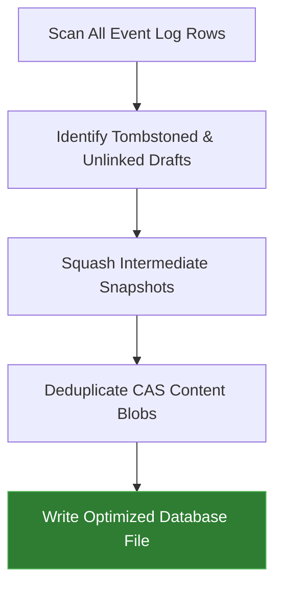

# SpecStore Architecture & Compaction

At the heart of `libspec` is the **SpecStore**, an append-only transaction ledger designed to track changes in specifications over time without data pollution.

---

## Transaction Ledger Design

SpecStore does not overwrite database files. Every build or linking action adds an immutable event to the log. This design ensures:
*   **Auditability**: A historical timeline of design changes.
*   **Rollback Resiliency**: If a design step fails or is reverted, you can revert or restore to any historic point.
*   **No File Locking Issues**: Since we append events, git branch switching and parallel operations rarely experience database blockages.

---

## Content-Addressable Storage (CAS)

To prevent the append-only log from bloating when specifications are re-compiled without changes, `libspec` utilizes **Content-Addressable Storage (CAS)**:

1.  Each component (class docstring, attributes, inherits) is hashed using MD5.
2.  When a snapshot is stored, the spec payload only references the component hashes instead of storing duplicate text.
3.  If a developer builds a specification ten times without changing the text, ten snapshot events are written, but the underlying text data is stored exactly once.

```text
Log Event Sequence:
[ Event 1: Snapshot Created ] ──> Components: { HashA, HashB }
[ Event 2: Snapshot Created ] ──> Components: { HashA, HashB, HashC }
[ Event 3: VCS Link Hash ] ─────> Links Event 2 to Git Commit 8a1e2f3
```

---

## Database Compaction

Over long development cycles, intermediate draft snapshots can accumulate (e.g., compile cycles run by agents during local testing). To keep the ledger file lightweight and optimize query lookup speeds, `libspec` includes a **Compaction Engine**.

Running the `compact` command does the following:



### Compaction Details:
1.  **Draft Pruning**: Any snapshot that is not linked to a Version Control (VCS) commit hash and is older than the current working set is squashed.
2.  **Referential Integrity**: All active snapshots retain their component bindings.
3.  **Physical Space Recovery**: The SQLite database runs a `VACUUM` call (or JSON Lines files are rewritten), shrinking the physical storage footprint.
