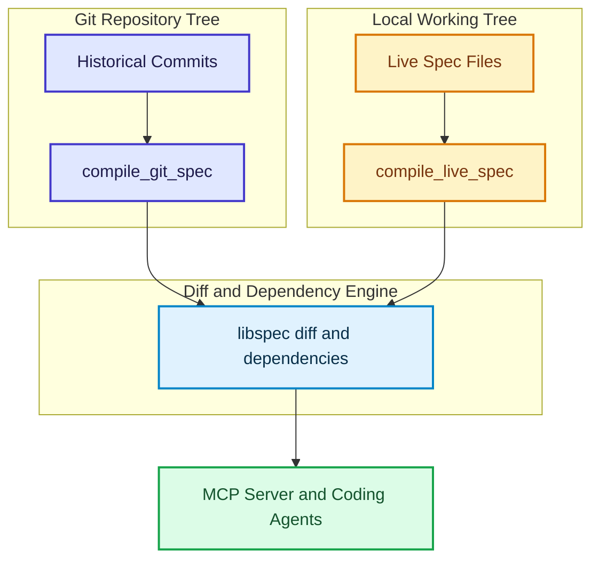

# Git-Native Architecture & Workspace Lifecycle

`libspec` operates on a **stateless, Git-native architecture**. Specifications are authored in Python classes, version-controlled directly in Git, and compiled deterministically in memory without relying on external database files or transaction logs.

---

## 1. Stateless & Git-Native Design

Unlike traditional specification systems that require a separate database or sidecar file, `libspec` treats your **Git repository as the single source of truth**:

1. **Live Specifications (`PENDING`)**:
   - Compiled on the fly directly from `spec/*.py` files in your active workspace.
   - Evaluates class hierarchies, docstring templates, MRO inheritance chains (`inherits`), and logical dependencies (`depends_on`).
2. **Historical Specifications**:
   - Extracted dynamically from Git object trees at any given commit or ref (e.g. `HEAD`, `HEAD~1`, `main`, tags).
   - `compile_git_spec(ref)` extracts the specification files at that revision in memory, compiles their AST, and computes deterministic component hashes.
3. **No Database Dependencies**:
   - There are no SQLite files or JSON Lines transaction ledgers to commit or synchronize across branches.
   - Branch switching, rebasing, and merge operations in Git naturally version and preserve specification history without file lock conflicts or corruption risks.


```mermaid
flowchart TD
    classDef git fill:#e0e7ff,stroke:#4338ca,stroke-width:2px,color:#1e1b4b;
    classDef live fill:#fef3c7,stroke:#d97706,stroke-width:2px,color:#78350f;
    classDef diff fill:#e0f2fe,stroke:#0284c7,stroke-width:2px,color:#082f49;
    classDef agent fill:#dcfce7,stroke:#16a34a,stroke-width:2px,color:#14532d;

    subgraph GitTree ["Git Repository Tree"]
        GitCommit["Historical Commits"]:::git
        GitSpec["compile_git_spec"]:::git
        GitCommit --> GitSpec
    end

    subgraph Workspace ["Local Working Tree"]
        LiveFiles["Live Spec Files"]:::live
        LiveCompiler["compile_live_spec"]:::live
        LiveFiles --> LiveCompiler
    end

    subgraph Engine ["Diff and Dependency Engine"]
        DiffEngine["libspec diff and dependencies"]:::diff
        GitSpec --> DiffEngine
        LiveCompiler --> DiffEngine
    end

    DiffEngine --> AgentContext["MCP Server and Coding Agents"]:::agent
```


---

## 2. Fast Fingerprint Caching

To guarantee sub-millisecond CLI and MCP tool responses during repetitive agent iterations, `libspec` maintains a lightweight binary cache in `.libspec/cache/`:

- **Fingerprint Calculation**: Hashes file modification times and file sizes across `spec/**/*.py`.
- **Cache Hit Fast-Path**: If the workspace fingerprint is unchanged, `compile_live_spec()` loads pre-parsed `Component` dataclasses via fast marshal deserialization without re-importing Python modules.
- **Git Revision Caching**: Extracted Git revision ASTs are cached by their commit SHA (`.libspec/cache/<sha>.bin`).

---

## 3. Workspace `.agents/` Architecture & Skill Lifecycle

The `.agents/` directory located at the project root serves as the canonical workspace customization root for AI agent workflows and skills.

```text
.agents/
└── skills/
    └── libspec/             ← Canonical target directory
        ├── SKILL.md         ← Validated agent workflow instructions
        └── SKILL.md.bak     ← Backup created prior to atomic updates
```

### Skill Installation & Healing Mechanics:
1. **Atomic File Installation**: Rendered skill content is initially written to a process-isolated temporary file (`TEMP_<pid>_SKILL.md`) to prevent file corruption during concurrent executions.
2. **Skill Parser Validation**: The rendered markdown is validated via `SkillParser` to enforce valid YAML frontmatter (`name`, `description`) and non-empty content before deployment.
3. **Backup & Atomic Rename**: If an existing `SKILL.md` is present, it is backed up to `SKILL.md.bak` before atomic replacement (`os.rename`).
4. **Drift Detection & Auto-Healing**: On CLI or MCP startup, `libspec` compares installed `SKILL.md` content against rendered templates (ignoring line ending variations). If drift or corruption is detected, `libspec` auto-heals the skill unless `# libspec: disable-auto-heal` is present.


