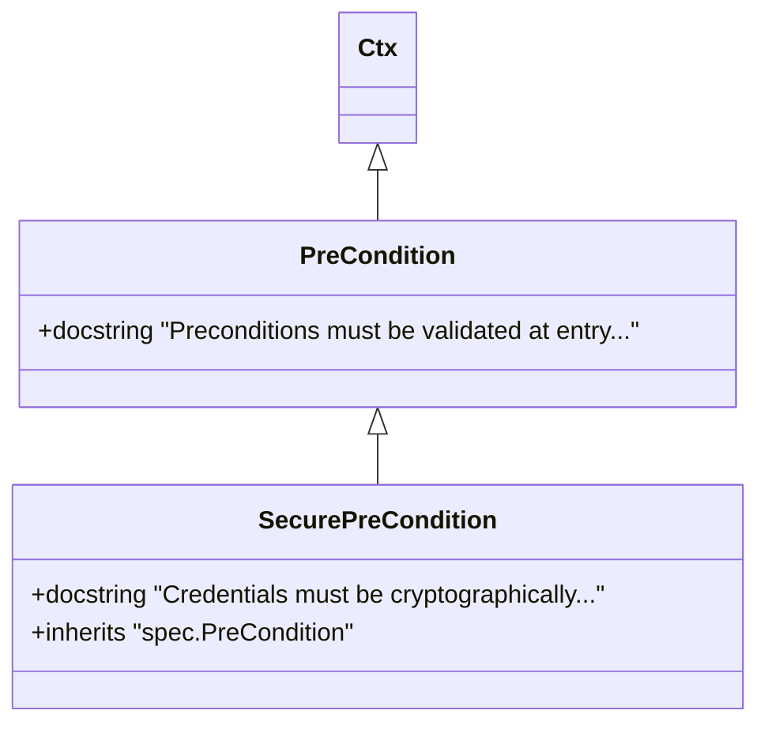

# Object Specification Mapping (OSM)

The central concept in `libspec` is **Object Specification Mapping (OSM)**. Similar to how Object-Relational Mapping (ORM) tools map programming classes to database schemas, OSM maps Python classes to structured specification designs.

Rather than translating OOP structures to SQL commands, OSM compiles declarative class models into content-addressed specification snapshots.

---

## Why Use Classes for Specifications?

Using Python classes as the primary specification syntax provides several advantages:

1.  **Familiar IDE Tooling**: Developers can write specifications in standard `.py` files, benefiting from syntax highlighting, auto-complete, static analysis, and version control.
2.  **Explicit Inheritance**: You can compose complex features by inheriting guidelines and constraints from base classes.
3.  **No Boilerplate**: Specifications do not require complex XML/YAML writing. The Python compiler handles namespacing, module loading, and class trees natively.

---

## How Inheritance is Compiled

In `libspec`, inheritance denotes a logical **"does this and more"** extension. For example, if a child class inherits from a parent requirement:

```python
class PreCondition(Ctx):
    """Preconditions must be validated at entry points."""

class SecurePreCondition(PreCondition):
    """Credentials must be cryptographically hashed first."""
```

During compilation:
1.  `libspec` traverses the class Method Resolution Order (MRO).
2.  Rather than prepending the parent's docstring prose directly into the child, the compiler generates a structured `<inherits><ref>...</ref></inherits>` link.
3.  This avoids text duplication, keeps database records compact, and enables tools like `libspec diff` to expand context references dynamically when needed.



---

## Multiple Inheritance and Mixins

One of the greatest strengths of OSM is multiple inheritance. You can define specialized guideline mixins and combine them to create robust requirement constraints:

```python
class Err(Ctx):
    """It is important that error handling be done excellently."""

class Indentation(Ctx):
    """Try to keep indentation under 4 levels."""

class RobustFeature(Err, Indentation, Feature):
    """This feature requires robust error handling and low indentation complexity."""
```

This allows projects to enforce project-wide quality rules (e.g. error handling, logging, formatting limits) across all newly created features without repeating the text.
When a coding agent reads `RobustFeature`, the MCP server resolves its inheritance path and feeds the complete context block (`Err`, `Indentation`, and `RobustFeature`) to the model, ensuring it knows all active rules.
