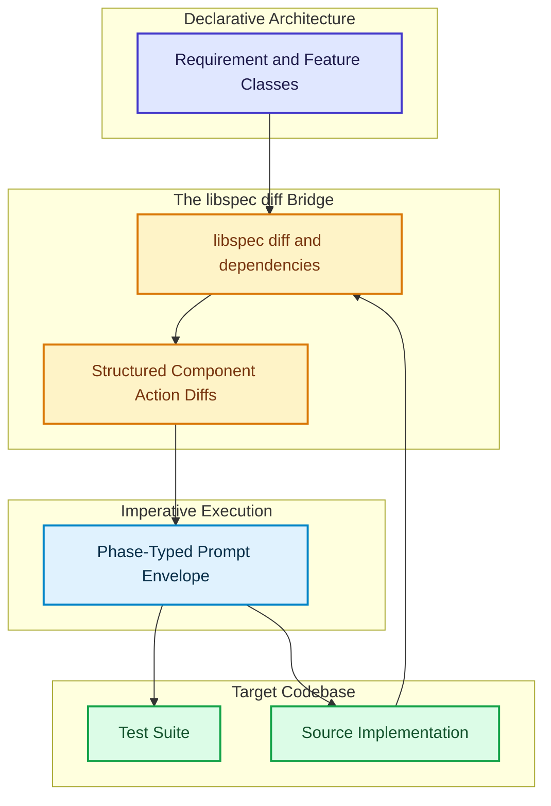
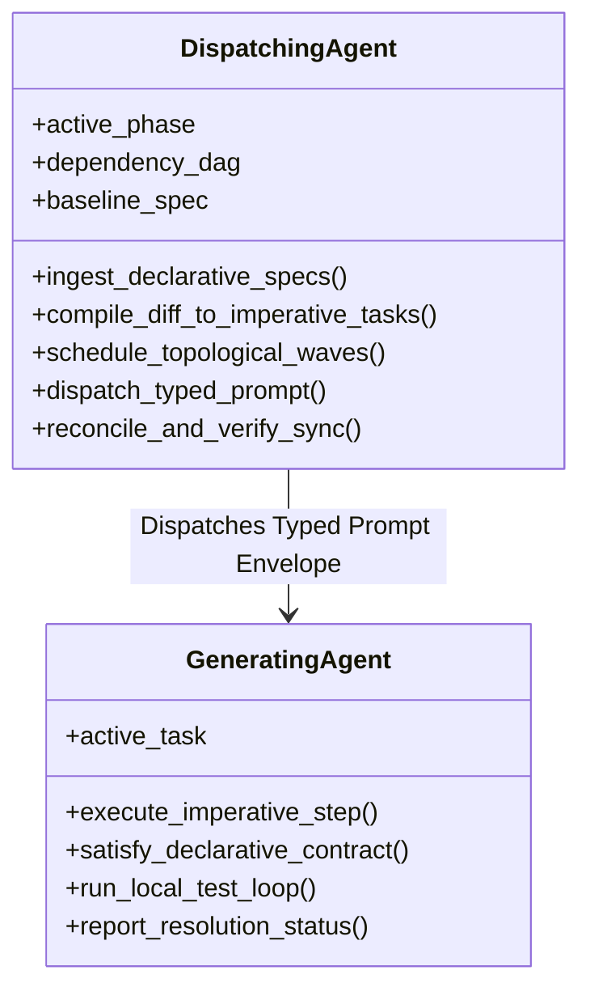

# Phase-Typed Prompts & Paradigms

A core design principle in `libspec` is the separation of **Declarative Architecture** from **Imperative Construction Logistics**, coupled with **Phase-Typed Prompt Orchestration** for autonomous AI coding agents.

---

## 1. The Declarative vs. Imperative Dichotomy

In software engineering and AI agent delegation, there is a fundamental distinction between:

1. **What the system IS (Declarative Specification)**:
   - Resides in `spec/*.py`.
   - Represents the enduring, version-controlled architecture, contracts, schemas, invariants, and behavioral requirements.
   - Serves as the target blueprint that the codebase must satisfy.
2. **What to DO now (Imperative Directives)**:
   - Ephemeral, procedural tasks (e.g. "Create file `x.py`", "Add method `foo()`", "Fix failing test `test_bar`").
   - Dispatched dynamically to coding agents to perform immediate codebase mutations.

---

## 2. The Non-Colocation Tenet

> **Imperative task instructions must NEVER live inside `./spec`.**

Specifications in `./spec` are architectural design documents. Storing one-off tasks, procedural migration scripts, or temporary checklists inside `./spec` pollutes the enduring design blueprint with transient construction residue.

Instead:
- `./spec` defines the declarative destination.
- `libspec diff` compiles the difference between the codebase and `./spec` into actionable imperative instructions.

$$\text{Imperative Instructions} = \text{Declarative Spec} \ominus \text{Current Codebase State}$$

---

## 3. Cognitive Roles: Dispatcher vs. Generator

Effective agent orchestration divides responsibilities between two distinct cognitive roles:

- **The Dispatching Agent (Orchestrator)**: Must understand the active workflow phase, topological dependencies (`depends_on`), and declarative architecture. It converts spec diffs into topological execution waves and dispatches targeted prompt envelopes to workers.
- **The Generating Agent (Worker)**: Receives a single typed prompt envelope with concrete file targets, prerequisite contracts, and test gates. It focuses purely on satisfying the local contract without needing global project state.

---

## 4. The Two-Axis Prompt Typing Taxonomy

Every prompt exchanged in `libspec` is classified along two axes:

1. **Paradigm Type**: `DECLARATIVE` vs. `IMPERATIVE`.
2. **Workflow Phase**: The active phase in the 9-step lifecycle.

| Phase | Paradigm | Focus |
|---|---|---|
| **Phase 1: Edit Spec** | `DECLARATIVE` | Granular specification authoring and contract formulation. |
| **Phase 2: Diff Spec** | `DECLARATIVE → IMPERATIVE` | Synthesizing component deltas from live specs and Git revisions. |
| **Phase 3: Topo Scheduling** | `IMPERATIVE` | Ordering tasks into topological waves based on `depends_on`. |
| **Phase 4: TDD Formulation** | `IMPERATIVE (Contract Driven)` | Writing failing unit tests that formalize declarative contracts. |
| **Phase 5: Implement** | `IMPERATIVE (Goal Directed)` | Implementing code to make tests pass and satisfy contracts. |
| **Phase 6: Quality Verification** | `IMPERATIVE` | Static analysis (`mypy`), linting (`ruff`), and dead code detection. |
| **Phase 7: Verify Spec Sync** | `DECLARATIVE` | Verifying that live specs match code claims with zero drift. |
| **Phase 8: Version Bump** | `IMPERATIVE` | Bumping SemVer in `pyproject.toml`. |
| **Phase 9: Commit & Present** | `IMPERATIVE` | Synthesizing git commit messages linking spec references. |
