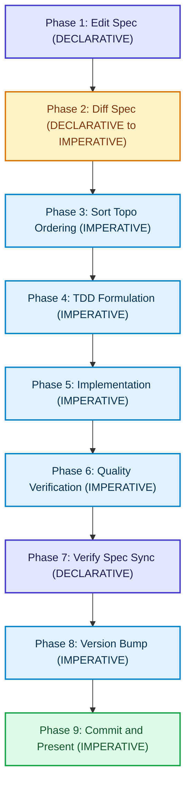

# How to Execute the Developer Agent Workflow

The `agent-workflow` command outputs the standardized 8-step development loop for coding agents and developers working with `libspec`.

---

## Running the Command

Generate workflow instructions formatted for your active environment:

```bash
uv run libspec agent-workflow
```

Optionally specify your agent platform (`antigravity`, `gemini`, or `claude`):

```bash
uv run libspec agent-workflow --agent antigravity
```

---

## The 9-Step Phase-Typed Developer Agent Loop




1. **Phase 1: Edit Spec [DECLARATIVE]**: Decompose broad requirements into granular, single-responsibility specification classes in `spec/`. Specs DECLARE the system architecture; do not put one-off imperative task steps here.

2. **Phase 2: Diff Spec (MANDATORY BEFORE CODING) [DECLARATIVE -> IMPERATIVE]**: Run `uv run libspec diff` (or `mcp_libspec_diff`) to inspect specification drift and compile component deltas into structured imperative action prompts.
3. **Phase 3: Sort Implementation Ordering [IMPERATIVE]**: Inspect component dependencies via `uv run libspec dependencies --topo` to sort components into topological order.
4. **Phase 4: Test-Driven Development [IMPERATIVE - Contract Driven]**: Write unit and integration tests for components in topological dependency order, formalizing declarative acceptance criteria.
5. **Phase 5: Implement [IMPERATIVE - Goal Directed]**: Implement code to satisfy the tests and meet declarative contracts.
   - Run tests: `make test`
   - Check formatting: `uv run ruff format --check`
   - Run linter: `uv run ruff check`
6. **Phase 6: Code Quality & Verification [IMPERATIVE]**: Run static analysis, type checking (`mypy`), and dead code detection (`vulture`).
7. **Phase 7: Verify Specification Sync [DECLARATIVE]**: Run `uv run libspec diff` to ensure live specs are synchronized with the final implementation.
8. **Phase 8: Version Bump [IMPERATIVE]**: Bump the project version in `pyproject.toml` according to Semantic Versioning (`MAJOR.MINOR.PATCH`) using helper target commands (`make bump-patch`, `make bump-minor`, or `make bump-major`).
9. **Phase 9: Commit & Present [IMPERATIVE]**: Author a concise git commit message linking spec references and diff footprints, then present the changes.

---

## Customizing Workflow Hooks (.libspec/workflow.yaml)

Every software project uses different test runners, linters, and build tools. You can customize the commands recited to AI coding agents across the 9 phases by editing `.libspec/workflow.yaml`:

```yaml
hooks:
  post-edit:
    - "Validate specification syntax: `uv run libspec diff`"
  pre-test:
    - "Ensure dependencies are synced: `uv sync`"
  post-implement:
    - "Run tests: `make test`"
  pre-commit:
    - "Check formatting: `uv run ruff format --check`"
    - "Run linter: `uv run ruff check`"
    - "Run typechecker: `uv run mypy -p libspec`"
```

When an agent requests the workflow via `uv run libspec agent-workflow` or the `agent_workflow` MCP tool, `libspec` automatically injects these concrete project commands into the checklist bullets for each phase.

See the [Workflow Configuration Reference](../reference/workflow-yaml.md) for the complete list of hook anchors and schema options.

