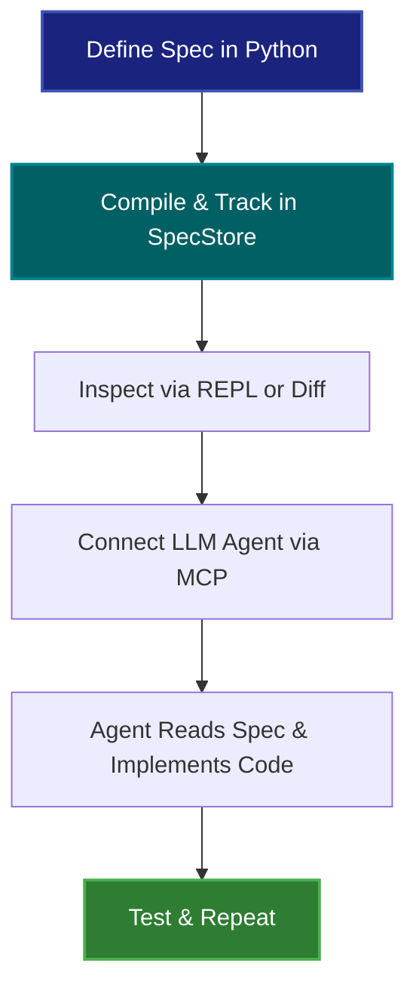

# libspec

> **"An ounce of spec is worth a pound of tokens."**

`libspec` is a **Specification Management System** in Python. Similar in spirit to Object-Relational Mapping (ORM) tools, `libspec` implements **Object Specification Mapping (OSM)** to compile logical requirements declared in Python classes into structured database snapshots. Instead of generating SQL schemas, it tracks how requirement definitions evolve over time.

By diff'ing snapshots and providing a native **Model Context Protocol (MCP)** server, `libspec` acts as a centralized, programmatic context layer for LLM coding agents. The developer workflow is incremental and exploratory, turning code generation from a gamble into disciplined delegation.

---

## The Workflow

---

## Core Philosophy

1. **Specifications as Code**: Define requirements as declarative Python classes. Use inheritance to express dependencies and mixins to compose guidelines.
2. **Version-Controlled Design**: Save specification snapshots directly into `SpecStore` (a lightweight, append-only SQLite transaction ledger).
3. **Seamless Agent Guidance**: Feed rich, dependency-sorted context directly to coding agents via LSP or MCP, ensuring they implement requirements correctly.
4. **Zero Boilerplate**: Offload relationship tracking to the transaction log instead of polluting specification files with manual wiring.

---

## Visualizing the Architecture

`libspec` bridges the gap between design-time specifications and run-time implementations. It provides tools for both human developers and LLM subagents:

*   **Developers** write and refine specifications using familiar Python OOP syntax.
*   **The Compiler** builds these specs into content-addressed XML/JSON snapshots.
*   **The REPL & CLI** allow you to inspect, search, and diff specification snapshots.
*   **The MCP Server** exposes these tools directly to coding assistants.
